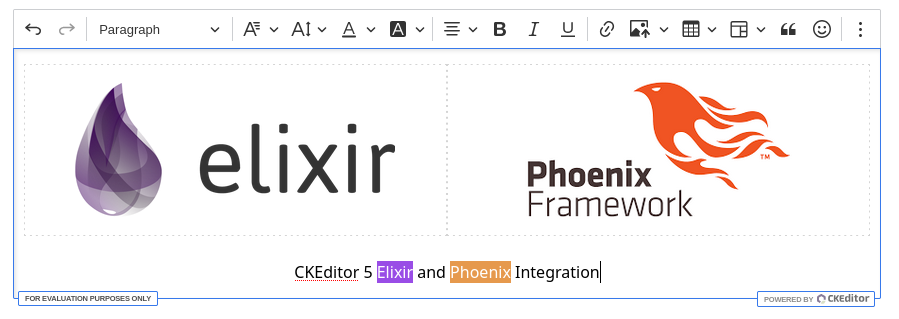

# CKEditor 5 Phoenix Integration ✨

[](LICENSE)
[](http://makeapullrequest.com)

[](https://github.com/Mati365/ckeditor5-phoenix/issues)
[](https://coveralls.io/github/Mati365/ckeditor5-phoenix?branch=main)
[](https://codecov.io/gh/Mati365/ckeditor5-phoenix?flag=npm)


CKEditor 5 integration library for Phoenix (Elixir) applications. Provides web components and helper functions for seamless editor integration with support for classic, inline, balloon, and decoupled editor types.

> [!IMPORTANT]
> This package is unofficial and not maintained by CKSource. For official CKEditor 5 documentation, visit [ckeditor.com](https://ckeditor.com/docs/ckeditor5/latest/). If you encounter any issues in the editor, please report them on the [GitHub repository](https://github.com/ckeditor/ckeditor5/issues).

<p align="center">
  
</p>

## Table of Contents

- [CKEditor 5 Phoenix Integration ✨](#ckeditor-5-phoenix-integration-)
  - [Table of Contents](#table-of-contents)
  - [Installation 🚀](#installation-)
    - [🏠 Self-hosted via NPM](#-self-hosted-via-npm)
    - [📡 CDN Distribution](#-cdn-distribution)
  - [Basic Usage 🏁](#basic-usage-)
    - [Simple Editor ✏️](#simple-editor-️)
    - [With LiveView Sync 🔄](#with-liveview-sync-)
  - [Editor Types 🖊️](#editor-types-️)
    - [Classic editor 📝](#classic-editor-)
    - [Multiroot editor 🌳](#multiroot-editor-)
    - [Inline editor 📝](#inline-editor-)
    - [Decoupled editor 🌐](#decoupled-editor-)
  - [Forms Integration 🧾](#forms-integration-)
    - [Phoenix Form Helper 🧑‍💻](#phoenix-form-helper-)
    - [LiveView Handler ⚡](#liveview-handler-)
  - [Configuration ⚙️](#configuration-️)
    - [Custom Presets 🧩](#custom-presets-)
    - [Use Custom Preset 🧩](#use-custom-preset-)
    - [Providing the License Key 🗝️](#providing-the-license-key-️)
  - [Localization 🌍](#localization-)
    - [CDN Translation Loading 🌐](#cdn-translation-loading-)
    - [Global Translation Config 🛠️](#global-translation-config-️)
  - [Custom plugins 🧩](#custom-plugins-)
    - [Registering Custom Plugins](#registering-custom-plugins)
  - [Package development 🛠️](#package-development-️)
  - [Psst... 👀](#psst-)
  - [Trademarks 📜](#trademarks-)
  - [License 📜](#license-)

## Installation 🚀

Choose between two installation methods based on your needs. Both approaches provide the same functionality but differ in how CKEditor 5 assets are loaded and managed.

### 🏠 Self-hosted via NPM

Bundle CKEditor 5 with your application for full control over assets, custom builds, and offline support. This method is recommended for advanced users or production applications with specific requirements.

**Complete setup:**

1. **Add dependency** to your `mix.exs`:

   ```elixir
   def deps do
     [
       {:ckeditor5_phoenix, "~> 1.4.1"}
     ]
   end
   ```

2. **Install CKEditor 5 via NPM:**

   ```bash
   npm install ckeditor5
   ```

3. **Register JavaScript hook** in your `app.js`:

   ```javascript
   import { Hooks } from 'ckeditor5_phoenix';

   const liveSocket = new LiveSocket('/live', Socket, {
     hooks: Hooks,
   });
   ```

4. **Import styles** in your `app.css`:

   ```css
   @import "ckeditor5/ckeditor5.css";
   ```

5. **Use in templates** (no CDN assets needed):

   ```heex
   <.ckeditor type="classic" value="<p>Hello world!</p>" />
   ```

### 📡 CDN Distribution

Load CKEditor 5 directly from CKSource's CDN - no build configuration required. This method is ideal for most users who want quick setup and don't need custom builds.

**Complete setup:**

1. **Add dependency** to your `mix.exs`:

   ```elixir
   def deps do
     [
       {:ckeditor5_phoenix, "~> 1.4.1"}
     ]
   end
   ```

2. **Register JavaScript hook** in your `app.js`:

   ```javascript
   import { Hooks } from 'ckeditor5_phoenix';

   const liveSocket = new LiveSocket('/live', Socket, {
     hooks: Hooks,
   });
   ```

3. **Exclude CKEditor from bundler** in your `config/config.exs`:

   ```elixir
   config :my_app, MyAppWeb.Endpoint,
     watchers: [
       esbuild: {Esbuild, :install_and_run, [
         :my_app,
         ~w(--external:ckeditor5 --external:ckeditor5-premium-features)
       ]}
     ]
   ```

4. **Add license key** (see [Providing the License Key 🗝️](#providing-the-license-key-️) section)

5. **Use in templates:**

   ```heex
   <%!-- Load CDN assets in <head> --%>
   <.cke_cloud_assets />

   <%!-- Use editor anywhere in <body> --%>
   <.ckeditor type="classic" value="<p>Hello world!</p>" />
   ```

That's it! 🎉

## Basic Usage 🏁

Get started with the most common usage patterns. These examples show how to render editors in your templates and handle real-time content changes.

### Simple Editor ✏️

Create a basic editor with default toolbar and features. Perfect for simple content editing without server synchronization.

```heex
<%!-- CDN only: Load assets in <head> --%>
<.cke_cloud_assets />

<%!-- Render editor with initial content --%>
<.ckeditor
  type="classic"
  value="<p>Initial content</p>"
  editable_height="300px"
/>
```

### With LiveView Sync 🔄

Enable real-time synchronization between the editor and your LiveView. Content changes are automatically sent to the server with configurable debouncing for performance optimization.

```heex
<.live_component
  id="editor"
  module={CKEditor5.Components.Editor}
  value={@content}
  debounce_ms={500}  # Optional debounce for performance
  change_event
>
```

Handle content changes in your LiveView:

```elixir
def handle_event("ckeditor5:change", %{"data" => data}, socket) do
  {:noreply, assign(socket, content: data["main"])}
end
```

**Event details:**

- Events are sent automatically when content changes
- `debounce_ms` controls the delay between changes and events (default: 300ms)
- Higher debounce values improve performance for large content or frequent changes

## Editor Types 🖊️

CKEditor 5 Phoenix supports four distinct editor types, each designed for specific use cases. Choose the one that best fits your application's layout and functionality requirements.

### Classic editor 📝

Traditional WYSIWYG editor with a fixed toolbar above the editing area. Best for standard content editing scenarios like blog posts, articles, or forms.

**Features:**

- Fixed toolbar with all editing tools
- Familiar interface similar to desktop word processors
- Works well in forms and modal dialogs


```heex
<%!-- CDN assets in <head> --%>
<.cke_cloud_assets />

<%!-- Classic editor in <body> --%>
<.ckeditor
  type="classic"
  value="<p>Initial content here</p>"
  editable_height="300px"
/>
```

### Multiroot editor 🌳

Advanced editor supporting multiple independent editable areas within a single editor instance. Perfect for complex layouts like page builders, newsletters, or multi-section content management.

**Features:**

- Multiple editable areas with shared toolbar
- Each area can have different content
- Ideal for CMS and page builder applications


```heex
<%!-- CDN assets in <head> --%>
<.cke_cloud_assets />

<%!-- Editor container --%>
<.ckeditor type="multiroot" />

<%!-- Shared toolbar --%>
<.cke_ui_part name="toolbar" />

<%!-- Multiple editable areas --%>
<div class="flex flex-col gap-4">
  <.cke_editable
    root="header"
    value="<h1>Main Header</h1>"
    class="border border-gray-300"
  />
  <.cke_editable
    root="content"
    value="<p>Main content area</p>"
    class="border border-gray-300"
  />
  <.cke_editable
    root="sidebar"
    value="<p>Sidebar content</p>"
    class="border border-gray-300"
  />
</div>
```

### Inline editor 📝

Minimalist editor that appears directly within content when clicked. Ideal for in-place editing scenarios where the editing interface should be invisible until needed.

**Features:**

- No visible toolbar until content is focused
- Seamless integration with existing layouts
- Great for editing headings, captions, or short content


```heex
<%!-- CDN assets in <head> --%>
<.cke_cloud_assets />

<%!-- Inline editor --%>
<.ckeditor
  type="inline"
  value="<p>Click here to edit this content</p>"
  editable_height="300px"
/>
```

**Note:** Inline editors don't work with `<textarea>` elements and may not be suitable for traditional form scenarios.

### Decoupled editor 🌐

Flexible editor where toolbar and editing area are completely separated. Provides maximum layout control for custom interfaces and complex applications.

**Features:**

- Complete separation of toolbar and content area
- Custom positioning and styling of UI elements
- Full control over editor layout and appearance


```heex
<%!-- CDN assets in <head> --%>
<.cke_cloud_assets />

<%!-- Decoupled editor container --%>
<.ckeditor type="decoupled">
  <div class="flex flex-col gap-4">
    <%!-- Toolbar can be placed anywhere --%>
    <.cke_ui_part name="toolbar" />

    <%!-- Editable area with custom styling --%>
    <.cke_editable
      value="<p>Initial content here</p>"
      class="border border-gray-300 p-4 rounded"
      editable_height="300px"
    />
  </div>
</.ckeditor>
```

## Forms Integration 🧾

Seamlessly integrate CKEditor 5 with Phoenix forms and LiveView for robust content management. Learn how to handle form submissions and real-time updates.

### Phoenix Form Helper 🧑‍💻

The editor automatically creates hidden input fields for form integration. Content is synchronized with form fields using the `field` attribute, making it compatible with standard Phoenix form helpers.

**How it works:**

- Hidden input field is created automatically
- Field name is derived from the `field` attribute
- Content is synchronized on form submission

```heex
<.form for={@form} phx-submit="save">
  <.live_component
    id="content-editor"
    module={CKEditor5.Components.Editor}
    field={@form[:content]}
  />

  <button type="submit">Save</button>
</.form>
```

### LiveView Handler ⚡

Complete LiveView integration with event handling for both real-time updates and form processing.

```elixir
defmodule MyApp.PageLive do
  use MyAppWeb, :live_view
  use CKEditor5  # Adds event handlers

  def mount(_params, _session, socket) do
    form = to_form(%{"content" => ""}, as: :form)
    {:ok, assign(socket, form: form)}
  end

  # Handle real-time content changes
  def handle_event("ckeditor5:change", %{"data" => data}, socket) do
    # Update content in real-time
    updated_params = Map.put(socket.assigns.form.params, "content", data["main"])
    {:noreply, assign(socket, form: to_form(updated_params, as: :form))}
  end

  # Handle form validation
  def handle_event("validate", %{"form" => params}, socket) do
    {:noreply, assign(socket, form: to_form(params, as: :form))}
  end

  # Handle form submission
  def handle_event("save", %{"form" => params}, socket) do
    # Process and save form data
    case save_content(params) do
      {:ok, _} ->
        {:noreply, put_flash(socket, :info, "Content saved successfully!")}
      {:error, _} ->
        {:noreply, put_flash(socket, :error, "Failed to save content")}
    end
  end
end
```

## Configuration ⚙️

You can configure the editor _presets_ in your `config/config.exs` file. The default preset is `:default`, which provides a basic configuration with a toolbar and essential plugins. The preset is a map that contains the editor configuration, including the toolbar items and plugins. There can be multiple presets, and you can switch between them by passing the `preset` keyword argument to the `ckeditor` component.

### Custom Presets 🧩

In order to override the default preset or add custom presets, you can add the following configuration to your `config/config.exs` file:

```elixir
# config/config.exs
config :ckeditor5_phoenix,
  presets: %{
    minimal: %{
      config: %{
        toolbar: [:bold, :italic, :link],
        plugins: [:Bold, :Italic, :Link, :Essentials, :Paragraph]
      }
    },
    full: %{
      config: %{
        toolbar: [
          :heading, :|, :bold, :italic, :underline, :|,
          :link, :insertImage, :insertTable, :|,
          :bulletedList, :numberedList, :blockQuote
        ],
        plugins: [
          :Heading, :Bold, :Italic, :Underline, :Link,
          :ImageBlock, :ImageUpload, :Table, :List, :BlockQuote,
          :Essentials, :Paragraph
        ]
      }
    }
  }
```

### Use Custom Preset 🧩

To use a custom preset, pass the `preset` keyword argument to the `ckeditor` component. For example, to use the `minimal` preset defined above:

```heex
<.ckeditor preset="minimal" value="<p>Simple editor</p>" />
```

### Providing the License Key 🗝️

CKEditor 5 requires a license key when using the official CDN or premium features. You can provide the license key in two simple ways:

1. **Environment variable**: Set the `CKEDITOR5_LICENSE_KEY` environment variable before starting your Phoenix app. This is the easiest and most common way.
2. **Preset config**: You can also set the license key directly in your preset configuration in `config/config.exs`:

   ```elixir
   config :ckeditor5_phoenix,
     presets: %{
       default: %{
         license_key: "your-license-key-here"
       }
     }
   ```

If you use CKEditor 5 under the GPL license, you do not need to provide a license key. However, if you choose to set one, it must be set to `GPL`.

If both are set, the preset config takes priority. For more details, see the [CKEditor 5 licensing guide](https://ckeditor.com/docs/ckeditor5/latest/getting-started/licensing/license-and-legal.html).

## Localization 🌍

Support multiple languages in the editor UI and content. Learn how to load translations via CDN or configure them globally.

### CDN Translation Loading 🌐

Depending on your setup, you can preload translations via CDN or let your bundler handle them automatically using lazy imports.

```heex
<%!-- CDN only: Load specific translations --%>
<.cke_cloud_assets translations={["pl", "de", "fr"]} />

<.ckeditor
  language="pl"
  content_language="en"
  value="<p>Content in English, UI in Polish</p>"
/>
```

### Global Translation Config 🛠️

You can also configure translations globally in your `config/config.exs` file. This is useful if you want to load translations for multiple languages at once or set a default language for the editor. Keep in mind that this configuration is only used when loading translations via CDN. If you are using self-hosted setup, translations are handled by your bundler automatically.

```elixir
# config/config.exs
config :ckeditor5_phoenix,
  presets: %{
    default: %{
      cloud: %{
        translations: ["pl", "de", "fr"]  # CDN only
      }
    }
  }
```

**Note:** For self-hosted setups, translations are handled by your bundler automatically.

## Custom plugins 🧩

Register custom CKEditor 5 plugins to extend functionality or add new features. This allows you to integrate your own plugins seamlessly into the editor.

### Registering Custom Plugins

To register a custom plugin, use the `registerCustomEditorPlugin` function. This function takes the plugin name and the plugin _reader_ that returns a class extending `Plugin`.

```javascript
import { CustomEditorPluginsRegistry } from 'ckeditor5_phoenix';

const unregisterPlugin = CustomEditorPluginsRegistry.the.register('MyCustomPlugin', async () => {
  // It's recommended to use lazy import to avoid bundling ckeditor code in your application bundle.
  const { Plugin } = await import('ckeditor5');

  return class extends Plugin {
    static get pluginName() {
      return 'MyCustomPlugin';
    }

    init() {
      console.log('MyCustomPlugin initialized');
      // Custom plugin logic here
    }
  };
});
```

In order to use the plugin you need to extend your config in `config/config.exs`:

```elixir
config :ckeditor5_phoenix,
  presets: %{
    default: %{
      config: %{
        plugins: [:MyCustomPlugin, :Essentials, :Paragraph],
        # ... other config options
      }
    }
  }
```

It must be called before the editor is initialized. You can unregister the plugin later by calling the returned function:

```javascript
unregisterPlugin();
```

If you want to de-register all registered plugins, you can use the `unregisterAllCustomEditorPlugins` function:

```javascript
import { unregisterAllCustomEditorPlugins } from 'ckeditor5_phoenix';

unregisterAllCustomEditorPlugins();
```

## Package development 🛠️

In order to contribute to CKEditor 5 Phoenix or run it locally for manual testing, here are some handy commands to get you started.

To run the minimal Phoenix application with CKEditor 5 integration, install dependencies and start the server:

```bash
mix playground
```

In order to run the playground in cloud mode, set the `CKEDITOR5_PLAYGROUND_MODE` environment variable to `cloud`:

```bash
CKEDITOR5_PLAYGROUND_MODE=cloud mix playground
```

Run tests using the `mix test` command. All tests are located in the `test/` directory.

```bash
mix test
```

To generate a code coverage report, use:

```bash
mix coveralls.html
```

## Psst... 👀

Discover related projects for other frameworks and languages. Find inspiration or alternative integrations for CKEditor 5.

Looking for similar projects or inspiration? Check out these repositories:

- [ckeditor5-rails](https://github.com/Mati365/ckeditor5-rails)
  Effortless CKEditor 5 integration for Ruby on Rails. Works seamlessly with standard forms, Turbo, and Hotwire. Easy setup, custom builds, and localization support.

- [ckeditor5-livewire](https://github.com/Mati365/ckeditor5-livewire)
  Plug-and-play CKEditor 5 solution for Laravel + Livewire applications. Fully compatible with Blade forms. Includes JavaScript hooks, flexible configuration, and easy customization.

## Trademarks 📜

Information about CKEditor® trademarks and licensing. Clarifies the relationship between this package and CKSource.

CKEditor® is a trademark of [CKSource Holding sp. z o.o.](https://cksource.com/) All rights reserved. For more information about the license of CKEditor® please visit [CKEditor's licensing page](https://ckeditor.com/legal/ckeditor-oss-license/).

This package is not owned by CKSource and does not use the CKEditor® trademark for commercial purposes. It should not be associated with or considered an official CKSource product.

## License 📜

Details about the MIT license for this project and CKEditor 5's GPL license. Make sure to review both licenses for compliance.

This project is licensed under the terms of the [MIT LICENSE](LICENSE).

This project injects CKEditor 5 which is licensed under the terms of [GNU General Public License Version 2 or later](https://www.gnu.org/licenses/old-licenses/gpl-2.0.html). For more information about CKEditor 5 licensing, please see their [official documentation](https://ckeditor.com/legal/ckeditor-oss-license/).
